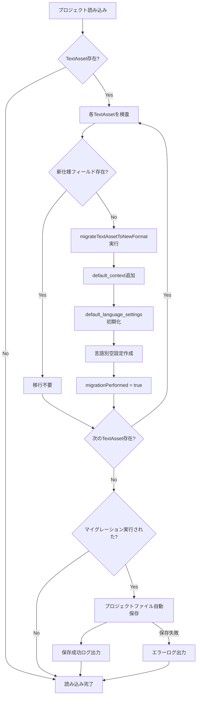

# TextAsset構造変化とマイグレーション設計

## 概要

このドキュメントでは、TextAssetの多言語対応実装（Phase 2B）における構造変化と、既存プロジェクトの自動マイグレーション機能について説明します。

## 構造変化の概要

### Phase 1 → Phase 2B の主な変更点

#### 新規追加フィールド

```typescript
export interface TextAsset extends BaseAsset {
  // 既存フィールド（変更なし）
  type: 'TextAsset';
  default_text: string;
  font: string;
  stroke_width: number;
  font_size: number;
  stroke_color: string;
  fill_color: string;
  default_pos_x: number;
  default_pos_y: number;
  opacity: number;
  leading: number;
  vertical: boolean;
  default_z_index: number;
  
  // 新規追加フィールド
  default_context?: string; // そのテキストの表す文脈
  default_language_settings?: Record<string, LanguageSettings>; // 言語別のデフォルト設定
}
```

#### TextAssetInstanceの拡張

```typescript
export interface TextAssetInstance extends BaseAssetInstance {
  // 既存フィールド
  multilingual_text: Record<string, string>;
  multilingual_overrides?: Record<string, LanguageOverrides>; // 後方互換性のため残存
  
  // 新規追加フィールド
  override_language_settings?: Record<string, LanguageSettings>; // 新仕様の言語別オーバーライド
  override_context?: string; // インスタンス個別の文脈設定
  override_opacity?: number; // インスタンス個別の不透明度
  override_z_index?: number; // インスタンス個別のz-index
}
```

#### 新しいLanguageSettings型

```typescript
export interface LanguageSettings {
  override_font?: string;
  override_font_size?: number;
  override_pos_x?: number;
  override_pos_y?: number;
  override_opacity?: number;
  override_z_index?: number;
  override_stroke_width?: number;
  override_leading?: number;
  override_vertical?: boolean;
  override_fill_color?: string;
  override_stroke_color?: string;
}
```

## マイグレーション戦略

### 設計原則

1. **完全後方互換性**: 既存プロジェクトは変更なしで動作する
2. **自動マイグレーション**: プロジェクト読み込み時に自動的に新仕様に移行
3. **透明性**: ユーザーは移行処理を意識する必要がない
4. **データ保全**: 既存データを失うことなく移行
5. **段階的移行**: 既存フィールドを残しつつ新機能を追加

### マイグレーション処理フロー



## 実装詳細

### 1. マイグレーション関数

**場所**: `src/types/entities.ts`

```typescript
export function migrateTextAssetToNewFormat(
  asset: TextAsset,
  supportedLanguages?: string[]
): TextAsset {
  // 既に新仕様フィールドを持っている場合はそのまま返す
  if (asset.default_language_settings !== undefined && asset.default_context !== undefined) {
    return asset;
  }

  const migratedAsset: TextAsset = {
    ...asset,
    // 新機能フィールドを追加
    default_context: asset.default_context || '',
    default_language_settings: supportedLanguages ? 
      supportedLanguages.reduce<Record<string, LanguageSettings>>((acc, lang) => {
        acc[lang] = {}; // 空のオーバーライド設定で初期化
        return acc;
      }, {}) : {}
  };

  return migratedAsset;
}
```

### 2. 自動マイグレーション処理

**場所**: `src/main/services/ProjectManager.ts`

```typescript
async loadProject(inputPath: string): Promise<ProjectData> {
  // プロジェクトファイル読み込み
  let projectData = await loadProjectFile(projectFilePath);
  
  // TextAssetを新仕様に移行
  let migrationPerformed = false;
  const supportedLanguages = projectData.metadata?.supportedLanguages || ['ja'];
  
  for (const [assetId, asset] of Object.entries(projectData.assets)) {
    if (asset.type === 'TextAsset') {
      const textAsset = asset as TextAsset;
      const migratedAsset = migrateTextAssetToNewFormat(textAsset, supportedLanguages);
      
      // 移行が実際に行われた場合
      if (migratedAsset !== textAsset || 
          textAsset.default_language_settings === undefined || 
          textAsset.default_context === undefined) {
        projectData.assets[assetId] = migratedAsset;
        migrationPerformed = true;
      }
    }
  }
  
  // 移行が実行された場合、プロジェクトファイルを自動的に保存
  if (migrationPerformed) {
    await saveProjectFile(projectFilePath, projectData);
  }
  
  return projectData;
}
```

### 3. 新しいヘルパー関数システム

**場所**: `src/types/entities.ts`

新仕様では、各言語・各設定項目の有効値を取得するための統一的なヘルパー関数を提供：

```typescript
// 統一的な言語設定取得関数
export function getEffectiveLanguageSetting<K extends keyof LanguageSettings>(
  asset: TextAsset,
  instance: TextAssetInstance | null,
  currentLang: string,
  setting: K
): LanguageSettings[K] | undefined

// 特定用途向けヘルパー関数
export function getEffectiveFontSize(asset: TextAsset, instance: TextAssetInstance | null, currentLang: string): number
export function getEffectivePosition(asset: TextAsset, instance: TextAssetInstance | null, currentLang: string): { x: number; y: number }
export function getEffectiveFont(asset: TextAsset, instance: TextAssetInstance | null, currentLang: string): string
// etc...
```

## マイグレーション実行タイミング

### 1. プロジェクト読み込み時（主要）

- `ProjectManager.loadProject()`実行時に自動実行
- 既存プロジェクトを開いた瞬間に透明に移行
- ユーザーは移行処理を意識しない

### 2. TextAsset作成時

- `AssetManager.createTextAsset()`で新仕様のTextAssetを作成
- 新規作成時は最初から新仕様フィールドを含む

## ログ記録とデバッグ

### マイグレーション実行ログ

```typescript
await this.logger.logDevelopment('textasset_migrated', 'TextAsset migrated to new format', {
  assetId,
  assetName: textAsset.name,
  supportedLanguages,
  projectPath: this.currentProjectPath,
});
```

### 自動保存ログ

```typescript
await this.logger.logDevelopment('project_auto_saved', 'Project auto-saved after TextAsset migration', {
  projectPath: this.currentProjectPath,
  projectFilePath,
});
```

## テスト戦略

### 1. ユニットテスト

**場所**: `tests/textasset-new-features.test.ts`

- マイグレーション関数の動作テスト
- 新旧仕様の互換性テスト
- ヘルパー関数の動作テスト

### 2. 統合テスト

- プロジェクト読み込み時の自動マイグレーションテスト
- UI操作による新機能の動作テスト

## パフォーマンス考慮事項

### 1. 移行処理の最適化

- 既に移行済みのアセットはスキップ
- 必要な場合のみプロジェクトファイル保存

### 2. メモリ使用量

- 言語設定は必要な場合のみ作成（undefinedで初期化）
- 空のオーバーライド設定は削除

## 今後の拡張性

### 1. 他のアセットタイプへの適用

この設計パターンは、ImageAssetやVectorAssetの多言語対応にも適用可能：

```typescript
export interface ImageAsset extends BaseAsset {
  // 既存フィールド...
  
  // 将来の多言語対応
  default_language_settings?: Record<string, ImageLanguageSettings>;
}
```

### 2. バージョン管理

プロジェクトファイルのバージョン情報を活用した、より詳細な移行制御：

```typescript
export interface ProjectMetadata {
  komae_version: string;
  project_version: string;
  // 将来的にasset_version等を追加可能
}
```

## トラブルシューティング

### よくある問題と解決方法

1. **マイグレーション後の保存失敗**
   - ファイル権限の確認
   - ディスク容量の確認
   - ログファイルでエラー詳細を確認

2. **旧仕様データの表示問題**
   - getEffectiveLanguageSetting関数で後方互換性を確保
   - multilingual_overridesフォールバック処理で対応

3. **パフォーマンス問題**
   - 大量のTextAssetを含むプロジェクトでの読み込み遅延
   - 必要に応じてバッチ処理や進捗表示の追加を検討

## まとめ

この設計により、既存ユーザーに影響を与えることなく、TextAssetの多言語対応機能を提供できます。自動マイグレーション機能により、ユーザーは新機能を意識することなく既存プロジェクトを継続利用でき、新機能が必要な場合のみ利用できる設計となっています。